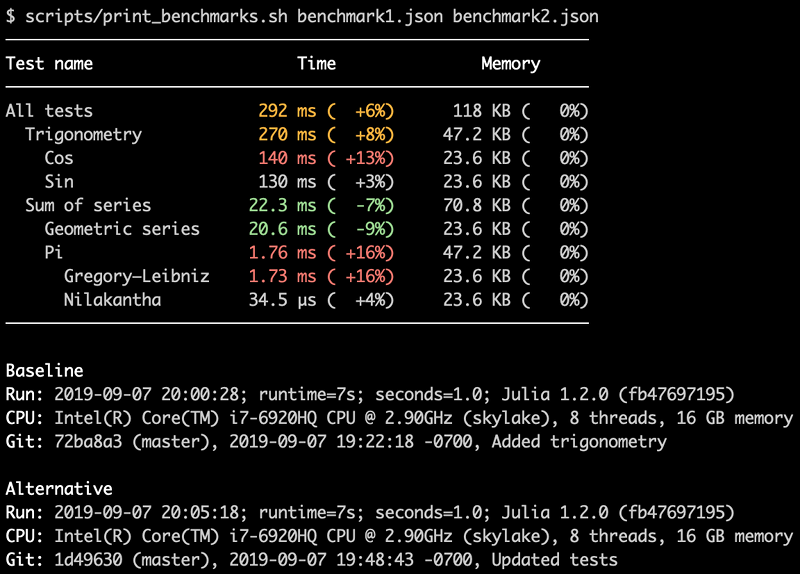

# Regression Analysis for Julia

This repository defines a macro called `@bench` that can be placed in front of regular
`@testset` macros. The test suite can then be run in two modes: no benchmarking, in which
case `@bench` does nothing (it falls back to just a `@testset`), and with benchmarking,
in which case `@bench` runs a benchmark of the code within the `@testset` using
`BenchmarkTools` with configurable settings.

The result of a benchmark run is stored to a JSON file, and multiple
JSON files can be compared pairwise or combined to a report, as in the screenshot below.

<div align="middle">

</div>
<br/>

A suggested use case for this macro is for the build server to simultaneously start one
build without benchmarking (just tests) that will finish fairly quickly, and one build
with benchmarking, that could take longer. This way, developers get feedback as soon as
possible if any test fails, and once the benchmark finishes, we can ensure that CPU time
and memory did not regress. If there’s ever a regression, we know the exact commit that
it occurred, and from within the benchmark report, we can click to view the commit diff.

Some advantages of using this `@bench` macro are that we make it trivial to enable
benchmarking (no need to write and maintain separate benchmarking scripts),
and we get very good benchmarking coverage (pretty much all tests are also benchmarked).
We can also reuse the same hierarchy and structure that we already have for our `@testset`s.

In the benchmark report screenshot above (from
[NonlinearEigenproblems.jl](https://github.com/nep-pack/NonlinearEigenproblems.jl)),
the test hierarchy is on the left,
and each commit creates a new column (split into two cells for CPU / Memory) appended on
the right. In the second to last commit, we can see how four tests regressed (red cells;
CPU and memory grew by several hundred percent). This was a bug introduced that might
otherwise have gone undetected.

## Usage

To enable benchmarking for a given `@testset`, just put a `@bench` macro in front of it:

```julia
@testset "Pi" begin
    @bench @testset "Gregory–Leibniz" begin
        s = pi_gregory_leibniz(1_000_000)
        @test isapprox(s, π; atol = 1e-6)
    end

    @bench @testset "Nilakantha" begin
        s = pi_nilakantha(100)
        @test isapprox(s, π; atol = 1e-6)
    end
end
```

(Note that since all benchmark results are aggregated hierarchically, it is not advised to
nest `@bench` expressions, since that will end up double counting elapsed time and memory.)

There is also an `@onlybench` macro that will run the test set only in benchmark mode,
not during unit tests. This could be useful for slower tests that are not needed to run
as part of the regular unit tests.

See the sample tests included in this repository for a simple example, or
[NonlinearEigenproblems.jl](https://github.com/nep-pack/NonlinearEigenproblems.jl)
for an actual use case. Also see the Scripts section below for how to run
and view the benchmark.

## Scripts
This repository includes a few different scripts used for unit tests and benchmarking,
described below. All should be run from the top-level package directory.

#### `run_tests.sh`
Runs unit tests only (no benchmarks) for all tests, or a subset thereof (by specifying
a test name / regex as a command line argument). Example to run the "series" tests:

```sh
$ scripts/run_tests.sh series
```

#### `run_benchmark.sh`
Runs the benchmark suite for all tests, or a subset thereof (by specifying a test name /
regex). Example that runs all benchmarks and stores the output to `benchmark.json`:
```sh
$ scripts/run_benchmark.sh benchmark.json
```
By default, all `@testset`s are benchmarked for a minimum of 1 second. That can be
increased to do a more accurate benchmark. Here's an example that benchmarks all "series"
tests for 10 seconds each:
```sh
$ scripts/run_benchmark.sh series.json 10.0 series
```

#### `print_benchmarks.sh`
This script accepts one or two JSON file benchmarks as input, and either prints the result
of a single run, or a comparison of two runs, to stdout. Example:
```sh
$ scripts/print_benchmarks.sh benchmark1.json benchmark2.json
```


#### `benchmark_report.sh`
Generates an HTML report from any number of JSON file benchmarks, either specified as
input, or downloaded from a GitHub repository (the idea being that the CI tool puts the
reports there; for this to work, you'll need to link the GitHub repository in
`benchmark_report.jl`). The reports will be ordered by the time they were run. Example
to create and open a report for all matching JSON files in the current directory:
```sh
$ scripts/benchmark_report.sh bench*.json
```
Example to create a report for the `benchmarks` branch on GitHub:
```sh
$ scripts/benchmark_report.sh -o report.html -b benchmarks
```

## Directory layout

To illustrate how to use this tool, this repository includes a trivial sample project
and a few unit tests. This project uses a nested structure, where the test project
is an individual project living in the `test` folder and referencing the parent project.
This is modeled after the project layout of
[NonlinearEigenproblems.jl](https://github.com/nep-pack/NonlinearEigenproblems.jl).

```
.                   # top level for sample project
├── scripts         # test and report generation scripts
├── src             # sample project source
└── test            # top level for test project; unit tests go here
    ├── benchmark   # report generation code
    ├── src         # SampleProjectTest module; @bench macro definition
    └── test        # needed for "Pkg.test()" to work for the test project
```

## Caveats

Note that for the benchmark to be accurate, particularly when it comes to performance,
it is important to run each build in the same environment.
Notably, this is not necessarily the case when building on Travis, as Travis may
use different CPU platforms for different builds. To make this a bit more apparent,
the CPU details are shown in the benchmark report.

Also note that if the benchmark is not run for long enough, the results can be quite noisy.
For such a use case, this tool is not very reliable for detecting minor performance
regressions, but would still be helpful as a way to find major regressions in
performance and memory usage, such as bugs or type instability introduced during feature
work or refactoring.
